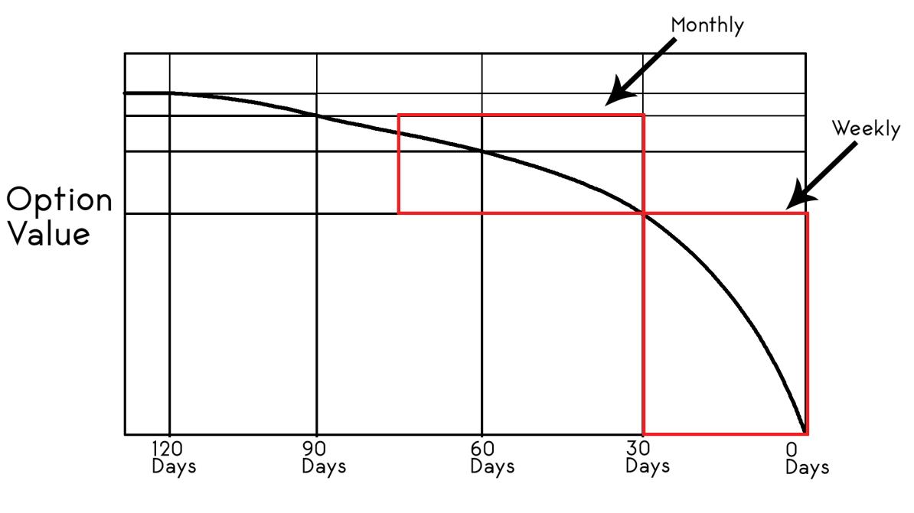
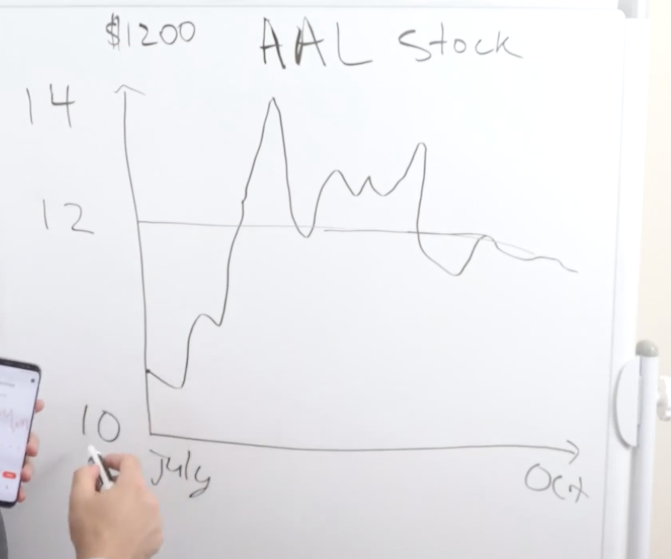
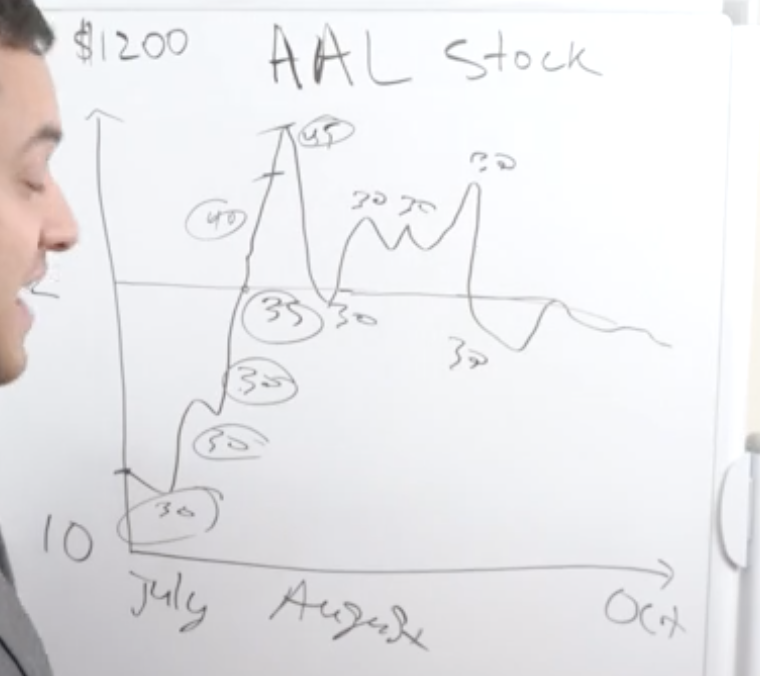
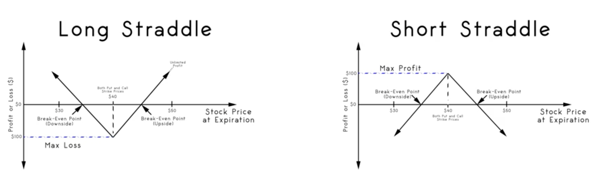

# Outline 
1. Basic 
2. Strategy 
3. Getting started (module 5)
4. Module 6: Why writing put?
5. Module 7: wheel + straddles + strangles
6. Module 8: small accout secret (spread + condor)

# 1. Basic 
> **Notes**
> 
> - use `option`, we manage our risk way much better than stock with equivalent gain
> 
> - as option `buyer`, look for cheaper one ~ less IV and more time
> 
> - as option `seller`, look for expensive one ~ more IV and less time
> 
> Don't lose money
>
> `bell curve` ~ probability with normal distribution is the key of our analysis
>
> `Stock` is completely random in short-term; it is voting machine, and good for long-term
> 
> `Delta` is the risk manager; With option, you can pre-determine how much risk you're gonna bet and how much benefit you're gonna take upfront
> 
> `weekly option advantages more to option seller, especialy non-earning week`
> 
> `don't get in hype stock` like what we see hype in youtube or Jim Cramer said since this 

## `Random walk down`, stock is supposed to move sideway and we will never know up/down
- As buyer, you need to expect stock in certain direction to move toward B.E., while seller benefits from the beginning and or it will be cusion when market goes against our position
- Buying option is gambling in the casino. To make it more reasonable, you need to make risk like 1% (3% max.)
  

- stock vs option (module 1:1-2)
- strike price (module 1:3-4 + module 3:0-1,4)

> Example, By given stock = 200k, strike 210k with bull expection. Now, stock 200k->250k, then profit = 250-210 = 40k x 100 = 4m

> Example, By given stock = 200k, strike 260k with bull-exploded expection. Now, stock 200k->250k, then profit = 250-260 = -10k = 0 #profit could not get below 0 

> Example, stock @ 100, covered call 110 for 5 
> 
> 100->100, 
> - option: get 5 
> - stock: get nothings
> 
> 100->110, 
> - option: get (110-100) + 5 = 15
> - stock: get 110-100 = 10
> 
> 100->90,
> - option: lose (100-90) + 5 = 5
> - stock: lose 100-90 = 10 
> 
> 100->120,
> - option: get 120 - BE = 120 - (Strike + Premium) + 5 = 120 - 110 + 5  = 15
> - stock: get 120-100 = 200
> 
> Hence, we lose opportunity getting unlimited profit, but we have better **risk management** with premium collected upfront as our cusion

## Premium, contract, intrinsic/extrinsic value (module 1:4,5)

`premium`: 
- price paid to acquire option **contract**, and determined by **intrinsic** and **extrinsic** value
- priced based on volatality

`contract`: obligation to buy/sell at given price on specific date
- expire every **friday** or **3rd friday each month**
- `call contract`  
  - buyer: giving the right to **buy** 100x of underlying stock with a specified price and time. 
    - **Market Optimisitc** they will buy at agreed price (lower) to sell at current price
  - seller: obligated to **sell** underlying at strike price
    - lose shares if assigned
- `put contract` 
  - buyer: giving the right to **sell** 100x of underlying stock with a specified price and time. 
    - **Market Pessimistic** they will buy at current price (lower) to sell at agree price
  - seller: obligated to **buy** underlying at strike price
    - get shares if assigned

`intrinsic value`: ITM - how much you stock passes strike

`extrinsic value`: factor outside like time(expiry date), IV

`expiry`: contract date; the more time, the more value

> Example, Given stock 162 and strike 150, intrinsic value = 162 - 150 = 12
> 
> Example, option 1month is worth less than option 3months

## ITM, ATM, OTM (module 1:7 + module 2:8)

`ATM`: strike price =~ stock price 
`OTM`
- OTM/Call: strike > stock
- OTM/Put: string < stock
  
`ITM`
- ITM/Call: strike < stock
- ITM/Put: strike > stock

`CTM`: strike price that closes to the money and make proper profit  
`FTM`: strike price that is farther OTM

##  payoff chart, black scholes chart, time decay chart (module 3:2 + module 4:5)
`Payoff chart` 

`Black Scholes chart` 

`Decay Chart`

## B.E., moneyness (profitability) (module 1:7 + module 3:3,5 ) ... when to use option, future, CFD, and stock

`Option buyers essentially **gains** less than stock investors, but gain more **ROI** percentage and less risk`

`B.E` 
    `B.E. of Call option` = strike + contract's fee 
    `B.E. of Put option` = strike + contract's fee

> Example, Given AAPL at 100 and **105** call for 5, what are B.E. and return when AAPL at 120?
>  
> **As stock buyer**, 
> - Initially, pay 100 (underlying price) x 100 upfront = **10,000** -- investment
> - B.E. point = entry point = **100**
> - At 120, return = 120 - B.E. = 120 - **100** = 20
> - return = 20 * 100 = 2,000 
> - RR = return / risk = 2,000 / 10,000 = 0.2
> - Gain = (100 --> 120) = 20%
>
> **As option buyer**,
> - Initially, pay 5 (contract fee) x 100 upfront = **500** -- investment
> - B.E. point = entry point + investment = **105** + **5** = 110
> - At 120, 120 - B.E. = 120 - **110** = 10 
> - return = 10 * 100 = 1,000
> - RR = return / risk = 1,000 / 500 = 2 
> - Gain = (5 --> 10) = 100%
> 
>
> Thus, at any given point after B.E., option buyers will gain 10 less than stock investors, but significantly less risk

## Early assignment, pin risk (module 5:2)
early execute the contract with remaining time

> stock @ 120, strike 110 expiring in a month
> intrinsic value = 120 - 110 = 10
> options's worth = 15 bcoz more time and intrinsic value 
> then, you can decide to close the contract early

`pin risk` risk of option seller holding option that expires barely ITM as market closes 

## volume, open interest, bid/ask spread (module 4:6)
bid = buyer's voice
ask = seller's voice
mark = middle point of bid and ask
`spread` = bid-ask
- stock < $10, spread < 0.2
- stock < $30, spread < 0.35
- stock < $50, spread < 0.5
- stock < $100, spread < 0.75
- stock < $500, spread < 1
- make it relate to premium you collect. Don't let spread more than 20% of premium

`open interest` 
- number of options/futures contracts **being held** by traders in active positions 
- **active contracts**

`volume` 
- number of options/futures contracts **traded in given period**
- **liquidity**
- indicates how often shares change hands between buyers and sellers

- trade only tight spread underlying option
market cap
employee size 

## IV (module 1:6 + module 7:5-6)
`IV`: price fluctuation 
- how much things moving up and down within given period
- the most influential to option pricing --> contract's fee is calculated based on IV and other factors

`historical volatility` - past
- based on past data
- 21-day period is most famous; 10, 50 are alternative for shorter and longer term
- it might 
`implied volatility` - future
- measure of how much stock goes up and down
- what you get paid for
- what trader expect going forward
- what option is pricing in for period going forward

`statistics`
- 52-wk IV high
- 52-wk IV low
- current IV percentile
- 52-wk HV high
- 52-wk HV low
- current HV percentile
- IV

`Put/Call Ratio (PCR)` = Put volume / Call volume
- PCR < 1: more call 

> Example, P/C Ration = 0.43 = 43% more put than call

`Event`
- Earning: IV goes high
- FDA (food & drug): phamarceutical/food chain IV goes high
- FED (interest): bank/finance IV goes high

> Example, historical volatility (21d) = 150, implied volatality (7d) = 95, meaning this is good opportunity to buy option

## Greek (module 3:6), delta, theta (module 4:1,3), gamma, vega (module 4:2,4)

`Delta`: how much option's price changed respecting $1 change of underlying 

- get us better understanding of our directional exposure
- the higher delta, the higher exposure
  - deep ITM, delta will be extremely high 
  - deep ITM + coming expiry, delta will be even extremely higher like 0.99
  - For **~+1/-1delta**, option move the same as stock (moving together; moving in tandem)
  - `buy very deep ITM` = buy stock with less investment since it move the same as stock
- `ATM` gives **0.5delta** always bcoz of blackshore model
  - 50:50 chance like flipping a coin
- tell us `how likely an option I have bought will expire  ITM` `how likely an option I have sold will expire OTM`
  - ATM: delta ~ 0.5
  - ITM: delta > 0.5
  - OTM: delta < 0.5
  - key to manage risk 

> Example, for seller with 0.2 Delta, 
> 
> Thus, it's 20% chance expire out of the money meaning you only have 20% chance that option's gonna to expire worthless.

- the farther OTM, the lower premium 
  - option seller will collect less from the lower premium
- tell us `how much exposure to a stock we have`. We can replace buying stock with buy delta 
  - x delta on option means we have x shares worth of equivalent exposure  
  - when you buy call, you're possitive delta (>0)
  - when you sell, you're negative delta meaning you're selling delta or reducing your exposure
  
> Example, instead of buying 20 shares of AMZN, we buy call option with 0.2 delta of AMZN
>
> It is the same exposure and yield result like buying 20 shares of AMZN 
> 
> Because 
> 
> (1) 100 delta will get option's price move identically (100%) to stock's price meaning option's price will move $1 if stock goes up $1
> 
> (2) 1 option contract has 100 shares of underlying
> 
> Thus, instead of investing whole position in stock, leveraging option to get in the market with pre-determine risk level

> Example, given stock@100 and 101 call for $1 with 0.5 delta, how much is option worth when stock goes up to 101
> 
> option's price = $1 + (1 x 0.5) = $1.50 

> Example, given AAPL @ 100, AAPL Call 110 for $5 with delta of 0.4, 1 month out, and earnings in 1 wk, how much is this option worth?
> 
> change = 110 - 100 = 10
> 
> delta = 10 x 0.4 = 4
> 
> Regardless of other factors, option's worth = 5 + 4 = $9
> now, invest of $5 x 100 turns to $9 x 100 = $900

> Example, You buy a call option for the January 2020 AAPL Call option at the $150 strike. Apple is currently at $125 per share. What is the best choice for what the delta is **likely** to be for the following example? 
> 
> Choice: 50, 35, 80, 100 delta
>
> In this case, we bought call OTM, so delta < 50 which is 35 

`Theta`: measure rate of **time decay** in the value of option/premium
- represent erosion of the option's value
- `theta decreases from buyer side and increase to seller side as time goes by`
- track `how much value options losing in value everyday`
  - option is essetially falling in value every single day
- The closer to the expiry, the more acceleration of theta for the seller    
  - For weekly option, theta is extremely high bcoz of very less time to decay
- As time passes, 
  - OTM 
      - buyer loses; theta decrease
      - seller wins; theta increase
  - ITM = buyer wins and seller loses
- always negative value, 
  - option's value losing its value as time goes by
  - Likewise, options seller gains those value 

`Theta/Time decay`
- the closer to expiry, the faster option losing in value 
- **Monthly** option losses value slower than **weekly** option
- For seller, if theta = 1, then you collect 100 = 1 x 100 shares everyday
- For weekly option seller,
  - less things happen, especially non-earning week
- For earning week,
  - dont' open position from scratch
  - option's really expensive
  - stock moves a lot
  
  

`Gamma`: measure change in **delta**
- the higher gamma, the more sensitive your portfolio

> Example, given 0.5 delta and 0.1 gamma, how much delta will be if stock goes up $1 
> 
> gamma = $1 x 0.1 = 0.1
> 
> new delta = 0.5 + 0.1 = 0.6

`Vega`: measure risk of changes in IV (volatality)
- the higher volatality, the more expensive option, the more likelihood of option passing strike price
- indicate `how much option pricing would be based on 1% change of underlying volatality`
- affect less for short-term

## Order, sell-to-open
`sell to open` open the position with selling to the market

## Premium vs Strike 
the more farther OTM, the less likely to be ITM, the less premium collectable

## Weekly, monthly, yearly, 
`weekly` least risk (from news and earnings), least benefit
`monthly` moderate risk (from news and earnings), moderate benefit
`yearly` most exposure, most benefit

4 weekly premium collected might be equal to 1 monthly premium collected.

`Goldman Scahs` trade 1-3 month option

## Return, Entry, Exit
- Avg return from stock market = 9% (Buffet makes 20%)

`Entry strategy` sell to open with strategy
`Exit strategy` no the best existed, just tailor to suite your will
  
`Annualized return` refractor your return over given period to entire year without compounding effect

> Example, return 1% regarding 1 month, then annualized return = 1% x 12 = 12%

****
****
****
> Example, AAL @ 12 in July, our blueprint from July to October is
> AAL is good for those who has little money
> 
> buy at 10 (low), keep selling call and put
> 
> collect $360 based on $1200 investment in 3 month

## dividend calendar
`dividend payoff`

## fundamental analysis: to select good stock for all possible ways (module 2:0-1)
1. `Market cap` = how much is the company worth
2. `PE ratio` = invest / return
- it will take PE year to get you cash on cash investment
- compare only in the same industry or in conjunction with other matrix

> Note: Faster growth results in higher PE ration
> Note: stock is valued based on all future earning discounted today and not what's just happening right now
> Note: analyze for 1 year and see its correlation to its history; `use chart to make decision reflecting its behaviour` --- no complex model, just keep it simple

3. `PS ration` `Price to Sales Ratio` = market cap / total sales (revenue) over 1 year
   
---
`ROE`
`P/E`
`Sales growth qtr over qtr`
`EPS growth qtr over qtr`
`Sales growth next 5 years`
`EPS growth next 5 years`
`Return on Assets`

`FCF Yield` = Free cash flow / Market cap
- compare FCF ratio in the same industry like AAPL and MSFT

## technical analysis: to get used to its behavior not to foresee (module 2:2-7)
`Line chart` as your main chart, and use `Candlestick shart` as secondary

`Volume` 
- need to see agreement between price and volume
- `sentiment`: find consensus
  - if price's going up with high volume and likewise, it's consensus; otherwise, it's not conclusive
  - `gap up` `breakout` after **consolidation** is also consensus

`MA`: 30d/90d 
- see price performance past 30d and 90d.
- if it conforms, it's consensus
- for uptrend, ma(90) should < ma(30)
  

`RSI`: 7d
as long as it stays around 50
- 20/80, oversold/overbought

`Bollinger`: 20d, 2sd
- the narrower, the lower volatility
- give trade range 

## Quiz
> Exam, NIO stock is trading at $39 per share. A $40 call option for 1-month out costs $5.63. What is the **breakeven** price for your call option? 
> ..
> result = 40 + 5.63 = $45.63

> Exam, You bought 3 call contracts on Apple stock. It was trading at $119 at the time of the purchase. You picked the $125 call for $2.75 expiring this week before earnings. After earnings on Friday the stock ends at $132.50 per share. How much **money** did you make?
> ..
> 132.5 - (125 + 2.75) = 4.75 * 3 * 100 = $1,425

# 2. Strategy 

> **Notes**
> 
> .....
> .....

## BUY call/put and thinking system (payoff chart, B.E., probability, risk mgmt)
...

## SELL call/put and thinking system (payoff chart, B.E., probability, risk mgmt)
...

## Beginner strategy: option only
- `buy call`,`long call`: buy call, pay to gain when stock rises

- `buy put`,`long put`: buy put, pay to gain when stock falls
  - max gain = 0 since stock can go negative
  - **use case**
    - (1) to speculate trash stock like oil
    - (2) to protect from downside
    - (3) to hedge positioning
  
> Example, stock @ 120, long 100 put for 3 
> 120 -> 50, 
> - option (long put) gains = 100 - 50 = +50
> - stock loses = 120 - 50 = -70
> - so, you loses 50 - 70 = -20

> Example, stock @ 100, long 100 put for 2
> 100 -> 0
> option gains = (100-0)-2

> Example, You expect a stock trading at $35 to fall. You believe it could be as low as $28 in the next week. You decided to buy a $32 put for $1.57. How much profit do you earn if the stock falls to $28?
> stock @ 35, long 32 put for 1.57
> 35 -> 28, then 
> (1) 32-28 = 4 x 100 = 400
> (2) 400 - (1.57 x 100) = 243

- `covered put`,`protected put`: sell put covered by short position in stock
- `short put`,`naked put`: sell put without protection
  - `mechanism`
    - if stock rise, secure premium collected
    - if stock fall, you need to buy stock at strike price
   
  - losing gain when stock falls
  - `max risk` = strike price - premium collected
  - same as insurance policy ~ `Buffet strategy`
  - `idea` it's non-losing strategy because you collected premium upfront and buy prefered stock at lower price
  - `benefit`
    - better entry price (cheaper) of your preferred stock, so called `cost reduction`
    - generate income when it goes sideway, upside, and even slightly down
  - `expect` 
    - sell put on high volotality (high premium) stock
    - sell put on high free cash flow stock
    - sell put on 1-month term is better than 1-Y term

StdDev = risk 
Compound Return = return
Sharp raio = risk / return

overwriting = covered call

- `short call`/`naked call`: sell ITM/OTM call, losing gain when stock goes up -- don't use this (too risky)

## Intermediate strategy: option + stock
- `synthetic call`: buy put + buy stock, pay to gain when stock rises 
- `** covered call **`: sell OTM call + buy stock, losing gain when stock falls 
  - `idea` buy lovely stock and sell in **every week** to collect income
  - `execution` buy stock + sell OTM call option in 1 transaction
  - `expect` high theta (less time), 20 delta, 2 S.D.
  - you need to have 100 shares to sell a proper covered call otherwise unlimited risk which is prohibited 
  - upside: you collect premium upfront to hedge your bet: you own 100 shares bcoz it's highly likely to go up; however, if it goes wrong, you lose less bcoz of premium collected upfront. More importantly, you earn from option's premium and stock appreaciation (gap between price)
  - downside: you can't sell at higher price

> Example, on Monday, buy AAPL @ 100 + sell 110 call for $3
> then, new cost basis = $97
> Friday, AAPL 100 -> 105 
> now, 110 call contract is void meaning you keep this stock
> next Monday, **repeat** with sell 115 call for $5
> then, new cost basis = $92, potential profit = 105-92 = 13*100 = 1,300
> Friday, AAPL 105 --> 110
> now, 115 call contract is void again.

> Example, stock @ 78, sell 80 call for 15,
> new cost basis = 63
> maximum gain = 15 + (80-78) = 17
> on Friday, stock 78->80
> 80 call is valid, so you lose 100 shares 
> actual gain = 80-78 = 2 .. still credited

- `covered put`/`married put`: sell stock + sell ATM/OTM put, losing gain when stock rises
- `protective call`/`synthetic long put`: sell stock + buy ATM call, pay to gain when stock falls

## Professional strategy: option + option
- `bull call spread`: buy ITM call + sell OTM call, losing gain when stock falls
- `bull put spread`: buy OTM put + sell ITM put, losing gain when stock falls
- `bear call spread`: buy OTM call + sell ITM call, losing gain when stock rises
- `bear put spread`: buy ITM put + sell OTM put, losing gain when stock rises
- `long straddle`/`buy straddle`: buy ATM put + buy ATM call, pay to gain when stock rises/falls         
- `long strangle`/`buy strangle`: buy OTM put + buy OTM call, pay to gain when stock rises/falls

## Advance strategy: option + option
- long combo
- collar
- short straddle / sell straddle / naked straddle
- short strangle / sell strangle 
- long call butterfly
- short call butterfly
- long condor / long call condor 
- short condor / short call condor 
- box spread 
- short box 
- covered strangle

## Advance strategy: option + time metric
- `leap`:

# 3. Getting started (module 5)
- stock + option mindset: put stocks to work (module 5: 0-3)
- weekly monthly yearly (module 5:5)
- ROI (module 5:6)

### Entry (module 2:8 + module 5:4)

1. `PE` = total price of company / what it earns
- the smaller, the cheaper
- the bigger
- **for value stock**
> Example, 
> rent 10k, house 100k, then PE = 10
> rent 10k, house 200k, then PE = 20 --> expensive

2. `PS` = b
- **for growth stock** bcoz growth company usualy has less/no earning

3. moving average
4. momentum
5. rsi
6. bollinger band **
7. trends
8. belief

### exit (module 2:9 + module 5:7)  
1. high RSI > 70
2. oversaturated / make all time high/low too often
3. TP point

### portfolio
1. progressive: 10-12 stocks 
2. retire: 20+ stocks for diversity

`Diversification` 
- at least 3 different industries
  - recommend: airlines, healthcare, technology
- at least 12 companies (5 stocks for large company) 

### risk management
`buy stock` don't risk more than 10-20% of your account
`buy option` risk < 2.5-5%

`reasoning` 
- good: Tesla's dominating EV's, producing cars at a rapid rate, expanding operations and profit margins are growing
- bad: Tesla's going to skyrocket

# 4. Module 6: Why writing put?
# 5. Module 7: wheel + straddles + strangles
# 6. Module 8: small accout secret (spread + condor)

# Appendix: Strategy Recap

1. `Long Call` - bet bull
> pay for bet "buy low, sell high"

2. `Long Put` - bet bear
> pay for bet "sell high, buy low"

3. `Short Call` 
- `Naked Call`
> buy stock at market price, and sell it out 

- `Covered Call` 
> collect and exit higher
> sell stock from portfolio at higher price 

4. `Short Put` - insure buyer from bear 
> collect and enter lower
> buy stock into portfolio at lower price 

1. `Debit Spread` - bet

- (1) `Bull Call Debit Spread` / `Bull Debit Spread` / `Call Debit Spread` - bet bull
> pay less for bet "buy low, sell limited high"
> sell call for premium to save buy leg
> buy

- (2) `Bear Debit Spread` - bet bear
> pay less for bet "sell high, buy limited low"
> sell call for premium to save buy leg 

2. `Credit Spread` - insure

- (1) `Call Credit Spread`
> insure bull (sell call) - at strike price, we will sell 
> instead of covered call, we buy CTM call to hedge 

- (2) `Put Credit Spread`
> insure bear (sell put) - at strike price, we will buy 
> instead of naked put,  

# Appendix: Strategy in Action
`see their behaviour in 1-month and 3-month chart`
`sell 25-35 delta` ~ yield the best sharp ratio
`collect premium that yield 1% a week`
`low delta = low risk when selling`

## The Wheel / Tripple Income Strategy
*** Weekly Strategy ****

`idea` **selling puts** to get in, and **selling call** to get out
- Selling Puts until assignment (got stock) → wait to see direction of its movement → Selling Calls until assignment (lose stock) → Repeat!
- The more times you collect premium on the put side the better!
  
`strike idea`
- strike of covered call: based on your valuation
- strike of naked put: anticipating premium based on proper RR 

`condition` --> make sure you diversify
- low price stock
- high volatility 
- good stock
  - have strong support
  - stable movement
  - high volume
- fantastic financial statement
  - good cash flow
- 
> Example, AAL

- sell cash secured puts to collect premium on stock that we're holding for long term
`goal` trade and be as agressive as possible without being assigned

`recovery`
when you sell put but price falls deep OTM 
> Example, stock @ 110, sell 100 put for 1, then 110->70. It is 30% OTM
> we need to 
> - wait for stock recovery to 100
> - start selling calls immediately to get money back as much as we can
> - hold onto stock

`strategy` 
- buy and hold stock, then sell covered call
- good stock 
  - have strong support

> Example, stock @ 100  
> (1) sell 98 put for 1, if not getting assigned that week
> (2) sell 97 put for 1, if not getting assigned that week
> (3) sell 95 put for 2, but stock fall to 94
> Then, we get assigned and need to purchase stock @ 95 because we sell 95 put. However, the actual cost basis = 95 - 4 (premium collected) = 91
> Next step is sell covered calls on the stock you get assigned with
> - agressive approach: the strike higher than stock cost basis ~ OTM
> - conservative approach: just ITM or ATM
> 

## Modified Bull Wheel
*** Weekly Strategy ****

`strategy` sell cash secured put + covered call to get benefit either side of the market
- if stock falls, you benefit from short call
- if stock rises, you benefit from short put

## Straddle - volatality spread betting developing volatility 
*** Earning Strategy ****

`Buy Straddle` buy ATM call + buy ATM put betting on **high IV** 
- benefit from price very moving up or down 

> Example, stock @ 100, to bet on both side, then buy 100 call with 3 and buy 100 put with 3
> Now, pay 6 x 100 = 600 upfront
> B.E. on downside = 100 - 6 = 94
> B.E. on upside = 100 + 6 = 106
> Then, anticipate exposive move 
> in case of 
> - 100->109, then 109 - 106 = 3 x 100 = 300 profit, ROI 300/600 = 50%
> - 100->90, then 94-90 = 4 x 100 = 400 profit, ROI 400/600 = 66%

`Sell Straddle` sell call + sell put betting on **low IV**
- benefit from price going nowhere
- Type
  - `Protected Straddle` covered by open position 
  - `Naked Straddle` NOT ALLOW !! it's unlimited

Note: IV rises during earning week

## Strangle - volatality exposion betting on news
*** News Strategy ****
Note: higher bet on volatility than `Straddle`

`strategy` buy OTM call + buy OTM put
Note: premium will be less than long straddle because of OTM

> Example, stock @ 100, buy 105 call with 0.5 + buy 95 put with 0.5
> Now, pay (0.5+0.5) x 100 = 100 upfront
> B.E. on downside = 95 - 1 = 94
> B.E. on upside = 105 + 1 = 106
> Then, anticipate exposive move 
> in case of 
> - 100->107, then 107 - 106 = 1 x 100 = 100 profit, ROI 100/100 = 100%
> - 100->93, then 94-93 = 1 x 100 = 100 profit, ROI 100/100 = 100%

## Long Call / Buy Call 
*** News/Earning Strategy ****
- position = 1
- market = bullish
- risk/reward = limited/unlimited
- B.E. = strike price + premium

## Spread / Vertical
*** Small Account Strategy ***
*** 3 diversified positions max. ***

`idea` buy or sell equal amount of options on the same stock but different strike or expiry
`Henry` diff strike, same expiry

#### 1. `bull spread` / `bull call debit spread` / `call debit spread`/`call debit spread` / `bull put spread` - profit from bull
   
   - `Config` buy CTM call + sell OTM call on same expiry
   - `idea` sell OTM call to help finance buy ATM call bcoz buy ATM call is expensive caused by high delta (high chance of ITM ~ success)
   - `win condition` stock >= strike buy
   - `return` max = strike sell - strike buy - premium paid
   - `risk` max = premium paid
   - `BE` strike buy + premium paid

#### 2. `bear spread`/`bear call debit spread`/`short call spread`/`call credit spread` profit from bear

*** Weekly Strategy ****

   - `General config - High return` sell CTM call + buy OTM call
   - `Henry - Risk managed`  sell OTM call + buy farther OTM call
     - to lower our risk because we move to OTM where buy leg will be cheaper
   - `return` max = premium collected
   - `risk` max = (strike buy - strike sell) - premium collected
   - `BE` strike sell + premium collected

> Example, sell 105 call for 2 + buy 110 call for 1
> then, net credit = 1

#### 3. `credit spread`/`bear call spread`/`put credit spread` spend less than collect premium ~ collect money

*** Weekly Strategy - Henry favorite ****
*** for robust stock ***
*** for stock you trust to hold long term ***

  - `Config` sell CTM put (to get credit) + buy OTM put (hedge sell leg from downside)
  - `Henry - Risk managed`  sell OTM put + buy farther OTM put
  - `max risk` strike sell - strike buy -  premium collected
  - `RR`  premium collected / (strike sell - strike buy)

> Example, sell 100 put for 2 + buy 95 put for 1, stock @ 105 -> 97, net credit = 2 - 1 = 1 
> Then, lose (100-97) - premium collect = 3 - 1 = 2

#### 4. `bear put debit spread` /  `bear put spread` / `debit spread`  spend more than collect premium  ~ spend money
maximize profit from beer market bet while minimizing loss 

`Config` buy CTM put + sell FTM put

## Iron condor
- assume that stock goes nowhere 

#### buy iron condor 

#### sell iron condor 
*** Weekly Strategy - Henry favorite ****
- collect premium for stock stagnant 

> Example, it's $500 trade
> 
> we don't risk $ 1,000 but $500 because it can go either way (mutually exlusive event ~ 1 event can happen at one time)
> risk the same but collect double (from both side) if stock goes nowhere

> Example, Netflix having strong support ~ 530 
> sell put 530 for 1 (delta = -0.08 ~ 8 = way way way out of the money) + buy put 525 for 0.69 ==> collect 0.31 for far OTM (very less chance to get executed)

# Appendix: Key takeaway
1. buy option 
2. sell covered call *** 
   1. best-fit: large portfolio
   2. warn: not work for stock's doing double/tripple like hype stock
   3. pro: collecting premium and getting dividend while holding stock
3. sell put ***
   1. buffet strategy
   2. moderate bullish strategy
4. buy put
   1. very bearish strategy
5. the wheel ***
   1. best-fit: life-long strategy
6. sell covered straddle ***
   1. best-fit: betting on volatality
   2. moderate bullish strategy
   3. sell put + covered call 
   4. collecting from time decay
7. strangle 
   1. widen straddle
8. spread ***
   1. best-fit: grow small account
9. iron condor **
   1.  combination of spread
10. rolling option ???
    1.  repair of Terrence: closing losing position and open next expiration for more time decay
11. poored man covered call ???
12. leap ???

# Appendix: Motto
- Spread trading is risker to lose collateral 
  - for portfolio > 100k, not to risk > 2.5k per trade at most
  - for portfolio < 100k, not to risk > 500 per trade at most
- take trade on Monday/Tuesday, and recheck on Thursday/Friday

  
# Appendix: Volatality analysis
- high vol --> `good for selling option`
  - airline: UAL, AAL, LUV
- avg vol
- low vol

# Appendix: Tastyworks
`P50` probability of making 50% of max potential profit
`POP` probability of profit
`EXT` extrinsic value based on mid price (For OTM, mid price = EXT)
`ITM%` percent of strike being ITM 
`DTE` # days to expiration

# Appendix: Hands on
- weekly
- bid/ask makes sense to ROI
- trading at near its high not low
- volume > 100 (50 is acceptable)
- open interest, the more the better
- IV > 70
- ATR is the key  ... the average/farthest movement to get OTM safer
- always good RR but not too agressive

- use cases
  - spike after IPO, sell put for their adjustment
  - sideway, sell put/call along 

---
# Appendix: Journal
- 8-Jun: PLTR @ 9, sell 6/10 exp. put 8.5 , for 0.5 
- 13-Jun: SIG @ 54, sell 6/17 exp. 56.5 put for 0.175, buy 55 put same expiry for 0.05 `result: $12.5 on 58.8 close`  `RR: 12.5 / 1.5x100 = 12.5 / 150 ~ 8.3% ` 

---
## Protective call / Synthetic long put: Sell and Buy ATM Call
- position = 2
- market = bearish
- risk/reward = limited/unlimited
- B.E. = stock price - call premium

## Covered call
- best fit with low volatality bcoz we can keep selling everyweek without risking exposure like AAL
